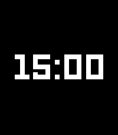

# Big and clean and all

A configurable Pebble watchface for **Pebble Time 2 (emery)** — large time, optional
steps/BPM, sun & moon times, day timeline, and many date formats. Built with the
[Rebble SDK](https://developer.repebble.com) (C + Clay/PKJS).



## Features

- **Time & date** — toggle time/date independently; 11 date formats + [Human Era year](https://en.wikipedia.org/wiki/Holocene_calendar)
- **Health** — steps and heart rate (when enabled)
- **Sun & moon** — sunrise/sunset and moonrise/moonset from phone GPS or manual coords
- **Day timeline** — wake → wind-down → bed bar with optional labels
- **Clay settings** — everything configurable from the Pebble app on your phone

Target platform: `emery` only (`package.json`).

## Requirements

- [Pebble SDK](https://developer.repebble.com) 4.x (tested with **4.17**)
- [pebble-tool](https://github.com/pebble-dev/pebble-tool) in a virtualenv or on `PATH`
- **Node.js** + `npm install` (for Clay)
- Optional: **Python 3** (screenshot script), **ffmpeg** (GIF)

## Quick start

```sh
git clone git@github.com:artyomxx/pwf-big-and-clean.git
cd pwf-big-and-clean

npm install
pebble build
pebble install --emulator emery    # or --phone <ip>
```

Refresh editor IntelliSense after a build:

```sh
pebble compile-commands --platform emery
```

## Configuration

Open watchface settings in the Pebble app (Clay). Location for sun/moon can come from
phone GPS or manual lat/lon/elevation. Timeline uses sleep data when enabled, otherwise
the **default wake time** (same value is the fallback when sleep data is missing).

## Store screenshots

Scripts drive the **emulator only** (time, battery, Clay message keys) — no special
watchface build required.

```sh
python3 scripts/capture_screenshots.py              # all scenes → screenshots/
python3 scripts/capture_screenshots.py --scene hero
scripts/screenshots_to_gif.sh                       # PNGs → screenshots.gif @ 2 fps
```

Edit `scripts/screenshot_scenes.json`:

- **`defaults`** — shared toggles + `location` + default `time` / `battery_percent`
- **`scenes[].settings`** — per-shot overrides (later wins)

Emulator has no health fixture — steps/BPM show `--` unless you capture on a real watch.

Publish to the app store:

```sh
pebble publish    # or: pebble screenshot --all-platforms
```

## Scripts

| Script | Purpose |
|--------|---------|
| `scripts/capture_screenshots.py` | Batch emulator screenshots from `screenshot_scenes.json` |
| `scripts/screenshots_to_gif.sh` | Combine `screenshots/*.png` into one palette-optimised GIF |
| `scripts/ffmpeg-gif.sh` | Lower-level ffmpeg GIF helper (used as reference) |
| `scripts/capture_health_export.sh` | Log health export from watch (`DbgProfileCmd` 3) |
| `scripts/analyze_wake.py` | Replay wake logic on `[health]` log lines |

## Debug profiling

Set `DEBUG_PROFILE` to `1` in `src/c/config.h` while developing. Counters accumulate
until reset/dump via app message `DbgProfileCmd` (usually key `10026` after build):

| Cmd | Action |
|-----|--------|
| `1` | Reset counters |
| `2` | Log counters |
| `3` | Dump sleep + minute history (`[health]` lines) |

```sh
pebble logs --phone <ip>
pebble send-app-message --phone <ip> --int 10026=2
```

Set `DEBUG_PROFILE` to `0` for release builds.

## Project layout

```
src/c/                 Watchface C (modules: settings, timeline, views, solar_calc, …)
src/pkjs/              Clay config + phone-side JS (location, settings sync)
scripts/               Screenshots, GIF, health export, wake analysis
package.json           UUID, platforms, message keys
wscript                Pebble SDK build rules
```

## Design notes

Implementation choices that are not obvious from the UI alone.

### Settings & Clay

- **`util_tuple_read_int32`** — accepts int8/16/32 and uint tuples; Clay often sends 1-byte toggles.
- **PKJS `autoHandleEvents: false`** — settings are sent manually; Clay's default cancel handler is not JSON-safe.
- **`isDisplayEnabled(..., false)` for timeline toggles** — empty Clay localStorage does not inherit `defaultValue` from config.
- **Int-only app messages** — watch inbox handler uses integer keys only.

### Display & performance

- **Date redraw cache** (`view_center.c`) — keyed on day, month, `DateFormat`, and `HumanEraYear`.
- **HR peek throttle** (`view_health.c`) — peek + 30 s minimum between BPM UI updates; full history read on minute tick.
- **Timeline redraw interval** (`config.h`) — `TIMELINE_REDRAW_INTERVAL_MIN` caps marker redraws on a short line.
- **`solar_calc.c`** — custom trig (no libm); `double` Julian dates for sub-day sun/moon accuracy.

### Timeline wake

With **wake from sleep** enabled, wake detection can lag behind activity when the firmware
reports peek-sleep before step-resume. `scripts/analyze_wake.py` replays `[health]` logs for
diagnosis.

### Screenshots

`capture_screenshots.py` applies top-level `defaults` then per-scene overrides. Settings are
sent twice with a short delay so the emulator face settles before capture.

## The MIT License (MIT)

Copyright © 2026 [Artyom R](https://artyom.cc)

Permission is hereby granted, free of charge, to any person obtaining a copy of this software and associated documentation files (the “Software”), to deal in the Software without restriction, including without limitation the rights to use, copy, modify, merge, publish, distribute, sublicense, and/or sell copies of the Software, and to permit persons to whom the Software is furnished to do so, subject to the following conditions:

The above copyright notice and this permission notice shall be included in all copies or substantial portions of the Software.

THE SOFTWARE IS PROVIDED “AS IS”, WITHOUT WARRANTY OF ANY KIND, EXPRESS OR IMPLIED, INCLUDING BUT NOT LIMITED TO THE WARRANTIES OF MERCHANTABILITY, FITNESS FOR A PARTICULAR PURPOSE AND NONINFRINGEMENT. IN NO EVENT SHALL THE AUTHORS OR COPYRIGHT HOLDERS BE LIABLE FOR ANY CLAIM, DAMAGES OR OTHER LIABILITY, WHETHER IN AN ACTION OF CONTRACT, TORT OR OTHERWISE, ARISING FROM, OUT OF OR IN CONNECTION WITH THE SOFTWARE OR THE USE OR OTHER DEALINGS IN THE SOFTWARE.